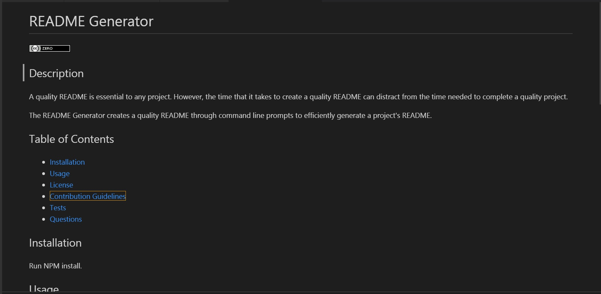

# Readme Generator

## Description
A quality README is essential to any project. However, the time that it takes to create a quality README can distract from the time needed to complete a quality project.
The README Generator creates a quality README through command line prompts to efficiently generate a project's README.

  
## Table of Contents
* [Installation](#installation)
* [Usage](#usage)
* [License](#license)
* [Contribution Guidelines](#contributing)
* [Tests](#tests)
* [Questions](#questions)
 
## Installation
Run NPM install.

## Usage
Once the application is installed, the user initiates it by typing 'node index' in the command line of the root directory of the project terminal.
Answer each question. An 'editor' option is provided for questions (like this one) that require longer answers. There is also an option to link to a screenshot.
Once all questions have been answered, the app will generate a file in the 'dist' folder in markdown to use as your README.

## License
This project is licensed under a MIT license. 

## Contributing
Clone the repo, then run npm install. Once contribution is completed, initiate a pull request through GitHub.

## Tests
node index

## Questions
Have additional questions? Contact [cjacktwil](http://github.com.cjacktwil) or email traceyjackson112@gmail.com.
